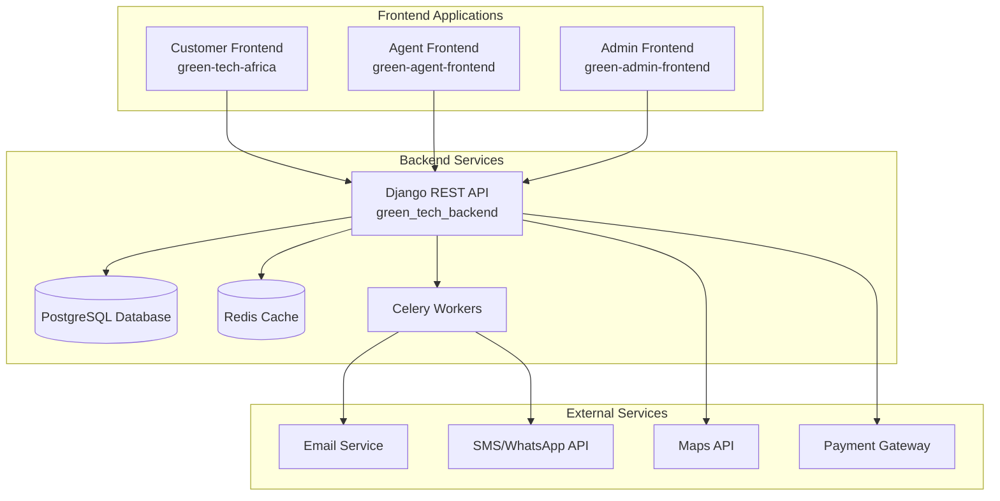

# Design Document

## Overview

The Green Tech Africa Eco-Property Platform is designed as a comprehensive multi-portal system that serves customers, agents/builders, and administrators through specialized React frontends backed by a unified Django REST API. The architecture leverages the existing tech stack while introducing new capabilities for property management, construction customization, project tracking, and sustainability scoring.

### Key Design Principles

- **Multi-Portal Architecture**: Separate optimized experiences for different user types
- **Mobile-First Design**: Progressive Web App (PWA) capabilities with offline support
- **Ghana-Focused Localization**: Initial market focus with expansion-ready architecture
- **Sustainability-Centric**: Green scoring and eco-feature prominence throughout the platform
- **Real-Time Collaboration**: Live updates for project tracking and communication

## Architecture

### System Architecture Overview



### Technology Stack

**Frontend Applications:**
- React 18 with TypeScript
- Vite for build tooling
- React Router 6 for navigation
- Tailwind CSS + shadcn/ui for styling
- TanStack Query for server state management
- React Hook Form + Zod for form validation
- PWA capabilities for mobile experience

**Backend API:**
- Django 4.x with Django REST Framework
- PostgreSQL for primary data storage
- Redis for caching and session management
- Celery for background tasks and notifications
- Django Channels for WebSocket support (real-time updates)

**Infrastructure:**
- Progressive Web App (PWA) for mobile optimization
- Service Worker for offline capabilities
- Local storage for offline data caching

## Components and Interfaces

### Frontend Component Architecture

Each frontend application follows a consistent structure with shared design patterns:

```
src/
├── components/
│   ├── ui/                     # shadcn/ui base components
│   ├── forms/                  # Form components with validation
│   ├── property/               # Property-related components
│   ├── construction/           # Construction customization components
│   ├── dashboard/              # Dashboard and analytics components
│   └── shared/                 # Cross-portal shared components
├── pages/
│   ├── auth/                   # Authentication pages
│   ├── dashboard/              # Dashboard pages
│   ├── properties/             # Property listing and detail pages
│   ├── construction/           # Construction request and tracking
│   └── profile/                # User profile and settings
├── hooks/
│   ├── useAuth.ts              # Authentication state management
│   ├── useProperties.ts        # Property data management
│   ├── useConstruction.ts      # Construction project management
│   └── useNotifications.ts     # Real-time notifications
├── lib/
│   ├── api.ts                  # API client configuration
│   ├── auth.ts                 # Authentication utilities
│   ├── utils.ts                # General utilities
│   └── constants.ts            # Ghana-specific constants
└── mocks/
    ├── properties.ts           # Ghana property demo data
    ├── construction.ts         # Construction options and pricing
    └── users.ts                # Demo user data
```

### Key Frontend Components

**Property Components:**
- `PropertyCard`: Displays property with sustainability score
- `PropertyFilters`: Advanced filtering with eco-features
- `PropertyComparison`: Side-by-side sustainability metrics
- `PropertyMap`: Interactive map with Ghana locations

**Construction Components:**
- `ConstructionWizard`: Multi-step customization process
- `EcoFeatureSelector`: Interactive eco-feature selection
- `CostCalculator`: Real-time pricing with Ghana multipliers
- `SustainabilityScorer`: Live green score calculation

**Dashboard Components:**
- `ProjectTimeline`: Visual project progress tracking
- `NotificationCenter`: Real-time updates and alerts
- `AnalyticsDashboard`: Role-specific metrics and KPIs
- `QuickActions`: Context-aware action shortcuts

### Backend API Design

**Core Django Apps:**
```
green_tech_backend/
├── core/                       # Project settings and configuration
├── accounts/                   # User management and authentication
├── properties/                 # Property listings and management
├── construction/               # Construction requests and projects
├── quotes/                     # Quote generation and management
├── sustainability/             # Green scoring and certifications
├── notifications/              # Email, SMS, and in-app notifications
├── analytics/                  # Dashboard analytics and reporting
├── ghana/                      # Ghana-specific data and localization
└── api/                        # API versioning and documentation
```

**API Endpoints Structure:**
```
/api/v1/
├── auth/                       # Authentication endpoints
├── properties/                 # Property CRUD operations
├── construction/               # Construction request management
├── quotes/                     # Quote generation and tracking
├── projects/                   # Project management and updates
├── sustainability/             # Green scoring and certifications
├── notifications/              # Notification management
├── analytics/                  # Dashboard data endpoints
└── ghana/                      # Ghana-specific data (regions, pricing)
```

## Data Models

### Core Data Models

**User and Authentication:**
```python
class User(AbstractUser):
    user_type = models.CharField(choices=USER_TYPES)  # customer, agent, admin
    phone_number = models.CharField(max_length=20)
    location = models.CharField(max_length=100)  # Ghana region/city
    preferred_language = models.CharField(default='en')
    notification_preferences = models.JSONField(default=dict)

class UserProfile:
    user = models.OneToOneField(User)
    avatar = models.ImageField()
    bio = models.TextField()
    sustainability_interests = models.JSONField(default=list)
    verified_agent = models.BooleanField(default=False)
```

**Property Management:**
```python
class Property:
    title = models.CharField(max_length=200)
    description = models.TextField()
    property_type = models.CharField(choices=PROPERTY_TYPES)
    location = models.CharField(max_length=100)  # Ghana-specific
    coordinates = models.JSONField()  # lat, lng
    price = models.DecimalField()  # in Ghana Cedis
    currency = models.CharField(default='GHS')
    
    # Sustainability features
    sustainability_score = models.IntegerField(default=0)
    eco_features = models.JSONField(default=list)
    energy_rating = models.CharField(max_length=10)
    water_efficiency = models.CharField(max_length=10)
    
    # Status and management
    status = models.CharField(choices=PROPERTY_STATUS)
    owner = models.ForeignKey(User)
    agent = models.ForeignKey(User, null=True)
    created_at = models.DateTimeField(auto_now_add=True)

class PropertyImage:
    property = models.ForeignKey(Property)
    image = models.ImageField()
    caption = models.CharField(max_length=200)
    is_primary = models.BooleanField(default=False)
```

**Construction and Customization:**
```python
class ConstructionRequest:
    customer = models.ForeignKey(User)
    title = models.CharField(max_length=200)
    location = models.CharField(max_length=100)
    budget_range = models.CharField(choices=BUDGET_RANGES)
    
    # Customization selections
    energy_features = models.JSONField(default=list)
    water_features = models.JSONField(default=list)
    materials = models.JSONField(default=list)
    smart_tech = models.JSONField(default=list)
    waste_management = models.JSONField(default=list)
    
    # Calculated values
    estimated_cost = models.DecimalField(null=True)
    sustainability_score = models.IntegerField(default=0)
    
    status = models.CharField(choices=REQUEST_STATUS)
    created_at = models.DateTimeField(auto_now_add=True)

class EcoFeature:
    name = models.CharField(max_length=100)
    category = models.CharField(choices=ECO_CATEGORIES)
    description = models.TextField()
    base_cost = models.DecimalField()
    sustainability_points = models.IntegerField()
    available_in_ghana = models.BooleanField(default=True)
    regional_multiplier = models.JSONField(default=dict)  # Ghana regions
```

**Project Management:**
```python
class Project:
    construction_request = models.OneToOneField(ConstructionRequest)
    agent = models.ForeignKey(User)
    quote = models.ForeignKey('Quote')
    
    # Timeline and progress
    start_date = models.DateField()
    estimated_completion = models.DateField()
    actual_completion = models.DateField(null=True)
    progress_percentage = models.IntegerField(default=0)
    
    # Status tracking
    current_phase = models.CharField(choices=PROJECT_PHASES)
    status = models.CharField(choices=PROJECT_STATUS)
    
class ProjectMilestone:
    project = models.ForeignKey(Project)
    title = models.CharField(max_length=200)
    description = models.TextField()
    due_date = models.DateField()
    completed_date = models.DateField(null=True)
    status = models.CharField(choices=MILESTONE_STATUS)

class ProjectUpdate:
    project = models.ForeignKey(Project)
    author = models.ForeignKey(User)
    title = models.CharField(max_length=200)
    content = models.TextField()
    images = models.JSONField(default=list)
    created_at = models.DateTimeField(auto_now_add=True)
```

**Quote and Financial Management:**
```python
class Quote:
    construction_request = models.ForeignKey(ConstructionRequest)
    agent = models.ForeignKey(User)
    
    # Pricing breakdown
    base_cost = models.DecimalField()
    eco_features_cost = models.DecimalField()
    labor_cost = models.DecimalField()
    materials_cost = models.DecimalField()
    total_cost = models.DecimalField()
    
    # Ghana-specific adjustments
    regional_multiplier = models.DecimalField(default=1.0)
    currency = models.CharField(default='GHS')
    
    # Quote management
    status = models.CharField(choices=QUOTE_STATUS)
    valid_until = models.DateField()
    version = models.IntegerField(default=1)
    
class QuoteLineItem:
    quote = models.ForeignKey(Quote)
    item_type = models.CharField(choices=ITEM_TYPES)
    description = models.CharField(max_length=200)
    quantity = models.DecimalField()
    unit_price = models.DecimalField()
    total_price = models.DecimalField()
    is_optional = models.BooleanField(default=False)
```

### Ghana-Specific Data Models

**Localization and Regional Data:**
```python
class GhanaRegion:
    name = models.CharField(max_length=100)  # Greater Accra, Ashanti, etc.
    code = models.CharField(max_length=10)
    major_cities = models.JSONField(default=list)
    cost_multiplier = models.DecimalField(default=1.0)
    available_materials = models.JSONField(default=list)

class GhanaPricing:
    region = models.ForeignKey(GhanaRegion)
    item_category = models.CharField(max_length=100)
    base_price = models.DecimalField()
    currency = models.CharField(default='GHS')
    last_updated = models.DateTimeField(auto_now=True)
```

## Error Handling

### Frontend Error Handling

**API Error Management:**
- Centralized error handling through TanStack Query
- User-friendly error messages with Ghana context
- Offline fallback with cached data
- Retry mechanisms for network failures

**Form Validation:**
- Real-time validation with Zod schemas
- Ghana-specific validation (phone numbers, addresses)
- Accessibility-compliant error messaging
- Progressive enhancement for poor connectivity

### Backend Error Handling

**API Error Responses:**
```python
# Standardized error response format
{
    "error": {
        "code": "VALIDATION_ERROR",
        "message": "Invalid input data",
        "details": {
            "field_errors": {...},
            "non_field_errors": [...]
        },
        "ghana_context": {
            "suggested_regions": [...],
            "currency_note": "Prices shown in Ghana Cedis (GHS)"
        }
    }
}
```

**Error Categories:**
- Authentication and authorization errors
- Validation errors with Ghana-specific context
- Business logic errors (e.g., unavailable features in region)
- External service errors (payment, SMS, maps)
- Rate limiting and quota errors

## Testing Strategy

### Frontend Testing

**Unit Testing:**
- Component testing with React Testing Library
- Hook testing for custom React hooks
- Utility function testing with Jest
- Form validation testing with mock data

**Integration Testing:**
- API integration testing with MSW (Mock Service Worker)
- User journey testing with Playwright
- Cross-browser testing for Ghana's common browsers
- Mobile responsiveness testing

**Ghana-Specific Testing:**
- Currency formatting and calculations
- Regional pricing multiplier accuracy
- Local phone number validation
- Ghana city/region data integrity

### Backend Testing

**Unit Testing:**
- Model validation and business logic
- API endpoint functionality
- Ghana-specific calculations and pricing
- Sustainability scoring algorithms

**Integration Testing:**
- Database operations and migrations
- External service integrations (SMS, email, maps)
- Real-time notification delivery
- File upload and image processing

**Performance Testing:**
- API response times under load
- Database query optimization
- Caching effectiveness
- Mobile network simulation for Ghana connectivity

### End-to-End Testing

**Critical User Journeys:**
- Complete construction request and customization flow
- Property search and inquiry process
- Quote generation and project tracking
- Multi-portal user role switching
- Offline functionality and sync

**Ghana Market Scenarios:**
- Regional pricing variations
- Local material availability
- Mobile-first user interactions
- Poor connectivity resilience